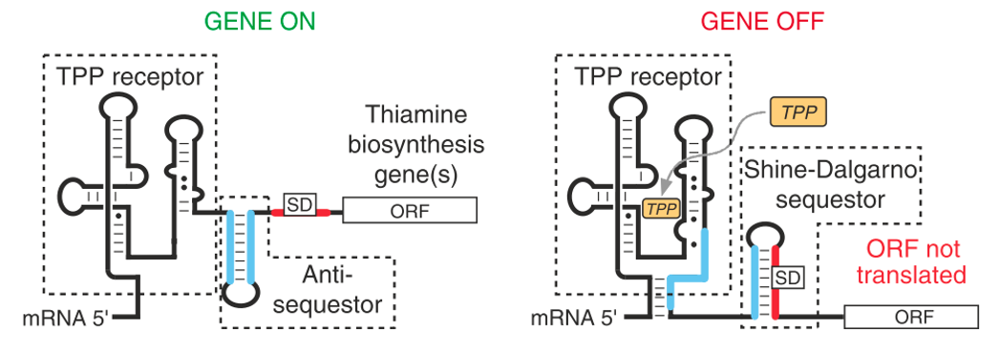

# La regulación génica en procariotas
.center[
```{r,echo=FALSE,out.width='100%'}
library(DiagrammeR)
library(dplyr)
a_graph <-
  create_graph() %>%
  add_node(label = "Regulación génica",node_aes = node_aes(shape = "rectangle",
                                                           fontsize = 8,
                                                           width = 1,
                                                           style = "rounded")) %>%
  add_node(label = "Factores sigma",node_aes = node_aes(shape = "rectangle",
                                                           fontsize = 6,
                                                           width = 0.7,
                                                           style = "rounded")) %>%
  add_node(label = "Factores \n transcripcionales",node_aes = node_aes(shape = "rectangle",
                                                           fontsize = 6,
                                                           width = 0.7,
                                                           style = "rounded")) %>%
  add_node(label = "Riboswitches",node_aes = node_aes(shape = "rectangle",
                                                           fontsize = 6,
                                                           width = 0.6,
                                                           style = "rounded")) %>%
  add_edge(from = 1, to = 2) %>% 
  add_edge(from = 1, to = 3) %>% 
  add_edge(from = 1, to = 4)
render_graph(a_graph,layout = "tree")
```
]
---
# La regulación génica en procariotas

### Factores Sigma

.pull-left[<br><br>
- Reconocimiento de la secuencia promotora.
- Reclutamiento de la holoenzima RNAP al promotor.
- Permiten la formación de la burbuja de transcripción.
]

.pull-right[
[
```{r,echo=FALSE,out.width='90%'}
library(knitr)
include_graphics("img/sf.png")
```
](https://cdnsciencepub.com/doi/10.1139/cjm-2016-0576?url_ver=Z39.88-2003&rfr_id=ori%3Arid%3Acrossref.org&rfr_dat=cr_pub++0pubmed&)
.right[Davis, *et al*, 2017]

[<br>
```{r,echo=FALSE,out.width='90%',fig.align='center'}
library(knitr)

```
](https://www.sciencedirect.com/topics/biochemistry-genetics-and-molecular-biology/sigma-factor)
.right[Burgess, 2001]
]

---
# La regulación génica en procariotas

### Factores Transcripcionales
<br><br>

.pull-left[<br><br>
- Regulación de la expresión en respuesta a señales celulares o ambientales.
- Activadores, represores o ambos.
]

.pull-right[
[
```{r,echo=FALSE,out.width='90%'}

```
](https://link.springer.com/chapter/10.1007/978-90-481-9069-0_2)
.right[Narain-Seshasayee, *et al*, 2011]
]

---
# Clasificación de las proteínas en grupos de ortología

<br>

.pull-left[
```{r,echo=FALSE,out.width='40%', fig.align='center'}
include_graphics("img/cog.png")
```

- Similitud de secuencia.
- 4631 grupos de ortología.
- 91 grupos de Factores Transcripcionales.
- 4 grupos de Factores Sigma.

]

.pull-right[
```{r,echo=FALSE,out.width='30%', fig.align='center'}
include_graphics("img/kegg.jpg")
```

- Similitud de secuencia.
- Clasificación funcional.
- Evidencia experimental.
- 22557 grupos de ortología.
- 369 grupos de Factores Transcripcionales.
- 9 grupos de Factores Sigma.

]

---
# La regulación génica en procariotas

### Riboswitches

.pull-left[

Formados por dos dominios:
- Aptámero.
- Plataforma de expresión.

[
```{r,echo=FALSE,out.width='90%'}
include_graphics("img/riboswitch.png")
```
](https://www.nature.com/scitable/topicpage/riboswitches-a-common-rna-regulatory-element-14262702/#)
.right[Edwards, *et al*, 2010]
]

.pull-right[
Atenuador transcripcional
[
```{r,echo=FALSE,out.width='100%'}
library(knitr)
include_graphics("img/terminador_transcripcional.png")
```
](https://www.nature.com/articles/nbt1268)
.right[Blount & Breaker, 2006]

Atenuador traduccional
[
```{r,echo=FALSE,out.width='100%'}
library(knitr)

```
](https://www.nature.com/articles/nbt1268)
.right[Blount & Breaker, 2006]
]
---
# Familias de riboswitches
<br><br><br>
.pull-left[
[
```{r,echo=FALSE, out.width='60%'}
include_graphics("img/rfam.png")
```
](https://www.ncbi.nlm.nih.gov/pmc/articles/PMC165453/)
<br><br>
- 49 familias de riboswitches.
- Conservación de secuencia.
- Estructura secundaria.

.right[Griffiths-Jones, *et al*, 2003]
]

.pull-right[
.center[
**T-Box leader**
]
```{r,echo=FALSE, out.width='100%'}
include_graphics("img/tbox.png")
```

]

---
# Antecedentes
<br>
.left-column[<br><br>
Estudiando 60 genomas bacterianos.

Los organismos patógenos intracelulares y endosimbiontes mostraron un bajo número de TFs.

Los organismos de vida libre mostraron una mayor proporción de TFs.

La proporción de TFs/gen aumenta con el genooma.
]

.right-column[<br><br>
```{r, echo=FALSE,out.width='110%'}

```
green: free-living organisms; red: pathogens; yellow: intracellular.  
.right[Cases, *et al*, 2003]

]


---
# Antecedentes
<br><br>
.left-column[<br><br>
Estudiando 90 genomas de bacterias y archaeas.

Los organismos de vida libre y simbiontes mostraron una mayor proporción de TFs.

Parásitos estrictos y patógenos mostraron una menor proporción de TFs.
]
.right-column[
[
```{r, echo=FALSE,out.width='110%'}

```
](https://www.sciencedirect.com/science/article/abs/pii/S1476927104000672?via%3Dihub)
.right[Pérez-Rueda, *et al*, 2004]
]
---
.center[
# Preguntas sin responder
]
.pull-left[
```{r, echo=FALSE,out.width='50%',fig.align='center'}

```
```{r, echo=FALSE,out.width='40%',fig.align='center'}

```
```{r, echo=FALSE,out.width='100%'}

```
]
.pull-right[<br><br><br><br>
.center[
**Enriquecimiento de familias**
]
```{r, echo=FALSE,out.width='50%', fig.align='center'}
include_graphics("img/barras.png")
```
]

---
class: center, middle

## Hipótesis

La frecuencia relativa de las familias de reguladores transcripcionales (factores sigma, factores transcripcionales y riboswitches) de los organismos procariontes varía de acuerdo al *phylum* al que pertenecen.<br><br>


## Objetivo general

Caracterizar la abundancia de elementos de regulación transcripcional en los *phyla* de bacterias y archaeas, así como su relación con el tamaño de genoma y estilo de vida de cada *phylum*.

---
.center[ 
## Objetivos particulares ]

<br>

1. Identificar *in silico* los elementos de regulación de la expresión génica; a) factores transcripcionales b) factores sigma y c) regulación por riboswitches.

2. Evaluar la relación entre la abundancia de reguladores transcripcionales y el tamaño de genoma en bacterias y archaeas.

3. Evaluar el enriquecimiento de las familias de reguladores transcripcionales en bacterias y archaeas de acuerdo con el *phylum*.

4. Analizar el contexto genómico de los factores transcripcionales y factores sigma.

---
class: chapter-slide

# Objetivo 1: Identificar *in silico* los elementos de regulación de la expresión génica; a) factores transcripcionales b) factores sigma y c) regulación por riboswitches.

---
# Selección de organismos de estudio
<br><br>

.pull-left[
- 4852 genomas de bacterias
- 281 genomas de archaeas

**Genomas redundantes**

```{r, echo=FALSE,message=FALSE}
library(dplyr)
library(kableExtra)
x <- tibble(Especie = c("Escherichia coli", "Escherichia coli"),
            cepa = c("DH1", "O145:H28"),
            CDS = c(4160,5776))
kable(x) %>% 
  column_spec(1,italic = TRUE,border_left = TRUE) %>% 
  column_spec(1:3,border_right = TRUE)
```
]
---
# Selección de organismos de estudio
<br><br>

.pull-left[
- 4852 genomas de bacterias
- 281 genomas de archaeas

**Genomas redundantes**

```{r, echo=FALSE,message=FALSE}
x <- tibble(Especie = c("Escherichia coli", "Escherichia coli"), 
            cepa = c("DH1", "O145:H28"),
            CDS = c(4160,5776))
kable(x) %>% 
  column_spec(1,italic = TRUE,border_left = TRUE) %>%
  column_spec(1:3,border_right = TRUE) %>% 
  row_spec(2, color = 'white', background = '#3269a8')
```

<br><br>
**Organismo representante de especie**

```{r, echo=FALSE,message=FALSE}
library(dplyr)

x <- tibble(Especie = c("Escherichia coli"), 
            CDS = c(5776))
kable(x)%>% 
  column_spec(1,italic = TRUE,border_left = TRUE) %>% 
  column_spec(1:2,border_right = TRUE)
```

]
--
.pull-right[
```{r, echo=FALSE}
phylum <- tibble(phylum = c("Actinobacteria", "Bacteroidetes", "Chlamydiae", "Crenarchaeota", "Euryarchaeota", "Firmicutes", "Planctomycetes", "Proteobacteria", "Spirochaetes", "Tenericutes","Verrucomicrobia"), n = c(371,212,16,46,156,487,18,1271,48,87,8) )

kable(phylum)
```

Total:  
2518 genomas de bacterias  
202 genomas de archaeas
]

---
# Conteo de factores transcripcionales y factores sigma

.center[
**Conteo de reguladores** ]
```{r,echo=FALSE}
x <- read.delim("data/table_cog.txt", header = TRUE, sep = "\t")
kable(x[c(1,2,5),c(1,4:7)], row.names = FALSE,align = 'c',format = "html",
      col.names = c("organismo",
                    "COG0568 (sigmaD/sigmaS/sigmaH)",
                    "COG1191 (sigmaF/SigB)",
                    "COG1508 (sigmaN)",
                    "COG1595 (ECF)")) %>% 
    kable_styling(position = "center") %>% 
  column_spec(1:5, border_left = TRUE)  %>% 
  column_spec(5, border_right = TRUE)
```

<br><br>

.center[
**Adición de tamaño de genoma y grupo filogenético**]
```{r, echo=FALSE}
x <- read.table("data/table_ko.txt", header = TRUE)
kable(x[c(1,2,5),-6], row.names = FALSE, align ='c', format = "html",
      col.names = c("organismo",	"phylum",	"clase",	"CDS",	
                    "K02405 (sigmaF)",	"K03087 (sigmaS)",	"K03088 (ECF)")) %>%
    kable_styling(position = "center")%>% 
  column_spec(1:7, border_left = TRUE)  %>% 
  column_spec(7, border_right = TRUE)
```

---
# Búsqueda de riboswitches de tipo atenuador transcripcional Rho-independiente
<br>

.pull-left[
.center[** Búsqueda de riboswitches**]
<br>
```{r,echo=FALSE,out.width='50%', fig.align='center',fig.cap="Matrices de covarianza (Aptámero)"}
include_graphics("img/rfam.png")
```
<br>
```{r,echo=FALSE,out.width='50%',fig.align='center'}

```
<br><br>
```{r,echo=FALSE,out.width='50%',fig.align='center', fig.cap="Regiones intergénicas"}

```
]
--
.pull-right[
**Predicción de estructura de terminador Rho-independiente**
<br><br>
[
```{r,echo=FALSE,out.width='90%',fig.align='center'}
include_graphics("img/ribo_transcripcional.png")

```
](https://www.asmscience.org/content/book/10.1128/9781555817992.chap23)
.right[Basado en Merino & Yanofsky, 2002]

```{r,echo=FALSE,out.width='40%',fig.align='center'}

```
]

---
# Número de reguladores encontrados en cada base de datos
<br><br>
.left-column[<br><br><br>
```{r,echo=FALSE,out.width='100%',fig.align='center'}

```
]
--
.right-column[
```{r,echo=FALSE,out.width='110%',fig.align='center'}
include_graphics("img/F2.png")
```
]
---
class: chapter-slide

# Objetivo 2: Evaluar la relación entre la abundancia de reguladores transcripcionales y el tamaño de genoma en bacterias y archaeas.

---
# El número de reguladores tiene una relación positiva con el tamaño del genoma.
```{r,echo=FALSE,out.width='83%',fig.align='center'}

```

---
# La tasa de incremento de reguladores transcripcionales es específica del *phylum*
```{r,echo=FALSE,out.width='83%',fig.align='center'}

```

---
# Número de reguladores usando la base KEGG
<br>
```{r,echo=FALSE,out.width='83%',fig.align='center'}

```

---
# La relación de TFs *vs* SFs es particular de cada *phylum*
```{r,echo=FALSE,out.width='85%',fig.align='center'}
include_graphics("img/F5.png")
```

---
class: chapter-slide

# Objetivo 3: Evaluar el enriquecimiento de las familias de reguladores transcripcionales en bacterias y archaeas de acuerdo con el *phylum*.

---
# Análisis de enriquecimiento

<br>
```{r,echo=FALSE}
x <- read.delim("data/table_cog.txt", header = TRUE)
kable(x[,c(1,2,4:7)], format = "html",row.names = FALSE,align = c('c'), table.attr = "style='width:90%;'",
      col.names = c("organismo", "phylum", 
                    "COG0568 (sigmaD/sigmaS/sigmaH)",
                    "COG1191 (sigmaF/SigB)",
                    "COG1508 (sigmaN)", "COG1595 (ECF)")) %>% 
  kable_styling(position = "center", full_width = FALSE) %>% 
  column_spec(1:6, border_left = TRUE) %>% 
  column_spec(6, border_right = TRUE) 
```
<br><br>
 
.center[**Prueba de Fisher**]
```{r,echo=FALSE}
x <- tibble(x = c("# reguladores COG0568 en Proteobacterias", "# de reguladores COG0568 en otros phyla"), y = c("# de reguladores de otros COG en Protebacterias", "# de reguladores de otros COG en otros phyla") )
kable(x,col.names = c("",""),table.attr = "style='width:60%;'", align = 'c') %>% 
  kable_styling(position = "center") %>% 
  column_spec(1:2, color = 'black', background = '#d4d3d2')
```

---
# El enriquecimiento de cada familia es específica del *phylum*

.pull-left[
```{r,echo=FALSE,out.width='110%',fig.align='center'}

```
```{r,echo=FALSE,out.width='30%',fig.align='center'}

```

Ampliamente distribuidos: 
- DtxR (COG1321) -> metabolismo de hierro.
- TFs con dominios helix-turn-helix (HTH)-like (COG2865).
- GntR (COG1725) -> homeostasis de nitrógeno y metabolismo de carbono.
]
--
.pull-right[
Archaeas
- TFs con dominio HTH (COG3373).
- TFs involucrados en biosíntesis de tiamina (COG1992).
- TFs con función desconocida (COG1709).

Firmicutes
- CodY (COG4465) -> regulación de la flagelina.
- ComK (COG4903) -> expresión de genes de competencia.

Proteobacterias
- MltR (COG3722) -> producción de antibióticos.
- TFs dependientes de sigma54 (COG4650).
]

---
# El enriquecimiento de cada familia es específica del *phylum*

.pull-left[
```{r,echo=FALSE,out.width='110%',fig.align='center'}
include_graphics("img/F6_1_ko.png")
```
```{r,echo=FALSE,out.width='30%',fig.align='center'}

```

Proteobacteria (114 KOs exclusivos)
- 25 grupos KO LysR -> virulencia, metabolismo, QS, motilidad.
- 21 KOs LuxR -> QS
- 18 grupos AraC -> resistencia a antibióticos y patogenicidad.
- 12 grupos TetR/AcrR -> patogenicidad y bombas de flujo.
]
.pull-right[<br><br>
Firmicutes (28 grupos KOs exclusivos)
- MarR -> bombas de flujo, resistencia.
- MerR -> respuesta a estrés oxidativo, metales pesados o antibiióticos.

Actinobacterias (4 grupos KO exclusivos)
- WhiB-like -> anabolismo de lípidos durante la infección y virulencia.

Bacteroidetes (2 grupos KO exclusivos)
- CRP/FNR -> respuesta a múltiples señales ambientales.
- HTH-type.

Archaeas (4 grupos KO exclusivos con función desconocida.
]
---
# El enriquecimiento de cada familia es específica del *phylum*

.center[**Factores sigma**]
```{r,echo=FALSE,out.width='70%',fig.align='center'}

```

.pull-left[
- sigH -> Genes de fase estacionaria y durante el inicio de la esporulación.
- sigI -> Choque térmico y sobrevivencia en bajas temperaturas.
]
.pull-right[
- sigmaH -> Respuesta a heat shock.  
- sigmaF en Chlamydias se expresa durante el ciclo de infección y en respuesta a choque térmico.
]
---
# Existe un enriquecimiento de familias dentro de cada *phylum*

```{r,echo=FALSE,out.width='100%',fig.align='center'}

```
.pull-left[
- AcrR (Actinobacterias) patogenicidad.
- LysR (Proteobacterias) virulencia, QS.
- MurR/RpiR (Tenericutes): reciclaje de pared celular.
- LacI/PurR (Verrucomicrobia): metabolismo de azúcares y purinas.
]
.pull-right[
- Factores sigma D, S y H preponderantemente abundantes en Chlamydias y Tenericutes.
- En Chlamydias sigmaN se expresa durante las fases activa y persistente de la infección.
]
---
# El enriquecimiento de cada familia es específica del *phylum*

.center[**Riboswitches**]

```{r,echo=FALSE,out.width='65%',fig.align='center'}

```
```{r,echo=FALSE,out.width='20%',fig.align='center'}

```

---
# Búsqueda de riboswitches de tipo atenuador traduccional
<br>

.pull-left[
.center[** Búsqueda de riboswitches**]
<br>
```{r,echo=FALSE,out.width='50%', fig.align='center',fig.cap="Matrices de covarianza"}
include_graphics("img/rfam.png")
```
<br>
```{r,echo=FALSE,out.width='50%',fig.align='center'}

```
<br><br>
```{r,echo=FALSE,out.width='50%',fig.align='center', fig.cap="Regiones intergénicas"}

```
]

.pull-right[
**Predicción de estructura de atenuador traduccional**
<br><br>
```{r,echo=FALSE,out.width='85%',fig.align='center'}
include_graphics("img/ribo_traduccional.png")

```

```{r,echo=FALSE,out.width='40%',fig.align='center'}

```
]

---
# El uso de riboswitches de tipo atenuador transcripcional y traduccional depende del *phylum*
```{r,echo=FALSE,out.width='85%',fig.align='center'}
include_graphics("img/F8.png")
```

---
class: chapter-slide

# Objetivo 4: Analizar el contexto genómico de los factores transcripcionales y factores sigma.

---
# Predicción de operones en el genoma de bacterias y archaeas.
<br><br>

.pull-left[
Utilizando el programa [Operon-mapper](https://www.ncbi.nlm.nih.gov/pmc/articles/PMC6247939/) de Taboada, *et al*, 2018. <br>

Operon-mapper toma en cuenta:
- Distancias intergénicas entre los genes vecinos.
- Relaciones funcionales de las proteínas codificadas.
]

.pull-right[
Conteo de TFs y SFs como:
- Monocistron.
- Cabeza de operon.
- Parte del cuerpo del operon.
]
<br>
```{r,echo=FALSE}
x <- read.delim("data/operones.txt")
kable(x,align = 'c') %>% 
  kable_styling(position = "center") %>% 
  column_spec(1:4,border_left = TRUE) %>% 
  column_spec(4,border_right = TRUE)
```

---
# Frecuencia de TFs y SFs en operon 
<br><br><br><br>
```{r, echo=FALSE,out.width='100%', fig.align='center'}

```
```{r, echo=FALSE,out.width='10%', fig.align='center'}
include_graphics("img/F9_3.png")
```
---
# Frecuencia de familias de factores sigma en operon 
```{r, echo=FALSE,out.width='100%', fig.align='center'}
include_graphics("img/F9_2.png")
```
---
class: chapter-slide
# Conclusiones
---
# Conclusiones
<br><br><br>
1. La abundancia de factores transcripcionales y factores sigma tiene una relación positiva con el tamaño del genoma.
2. La relación de factores transcripcionales y sigma con el genoma es específica de cada *phylum*.
3. La relación entre el número de factores transcripcionales y factores sigma por genoma es específica del *phylum* y muestra un comportamiento de compensación.
4. El enriquecimiento de las familias de reguladores trasncripcionales responde al estilo de vida de cada *phylum*.
5. Existen tendencias específicas de *phylum* en el uso de riboswitches de tipo atenuador transcripcional y traduccional.
6. El arreglo genómico de los factores sigma varía de acuerdo con la familia del factor.

---
class: chapter-slide

# Perspectivas

---
.center[
# Perspectivas 
]
<br><br>
1. Complementar el análisis de enriquecimiento de familias de factores transcripcionales y factores sigma utilizando otras bases de datos con clasificaciones de ortología, como EggNOG (Huerta-Cepas *et al*, 2016, 2019).
2. Realizar la búsqueda de motivos de secuencia conservados en las regiones de regulación de factores transcripcionales y factores sigma para cada familia de regulador.
3. Evaluar la simlitud de motivos de secuencia conservados de los reguladores
transcripcionales a diversos niveles taxonómicos.
4. Determinar los posibles genes blanco de las familias de factores transcripcionales y
factores sigma.
5. Evaluar la contribución del contexto genómico de los factores transcripcionales
en la regulación génica específica de *phylum*.

---
# Artículos publicados
<br><br>
.pull-left[
Enero 2021
<br><br>
```{r, echo=FALSE,out.width='100%', fig.align='center'}

```
]

.pull-right[
Agosto 2020
```{r, echo=FALSE,out.width='100%', fig.align='center'}
include_graphics("img/article_2.png")
```
]
---
# Colaboraciones adicionales

```{r, echo=FALSE,out.width='110%', fig.align='center'}

```

---
class: middle, center

```{r, echo=FALSE,out.width='40%', fig.align='center'}
include_graphics("img/gracias.png")
```

# Gracias!

---
class: chapter-slide, center, middle

## Diapositivas generadas usando el paquete  [xaringan](https://github.com/yihui/xaringan) de Yihui Xie y el theme [candidatura](https://github.com/josschavezf/candidatura) de Joselyn Chávez.

---
# Abundancia de reguladores a nivel de clase
<br>
```{r, echo=FALSE,out.width='80%', fig.align='center'}

```

---
# El número de genes por operon no disminuye conforme aumenta el tamaño de genoma.

Contrario al reporte previo de [Cherry,2003](https://www.sciencedirect.com/science/article/abs/pii/S0022519303931948?via%3Dihub) usando 26 genomas de bacterias y archaeas.

```{r, echo=FALSE,out.width='80%', fig.align='center'}

```

---
# Abundancia de operones en Proteobacterias
.pull-left[
```{r, echo=FALSE,out.width='80%', fig.align='center'}

```
]
.pull-right[
```{r, echo=FALSE,out.width='80%', fig.align='center'}

```
]

```{r, echo=FALSE,out.width='60%', fig.align='center'}

```


